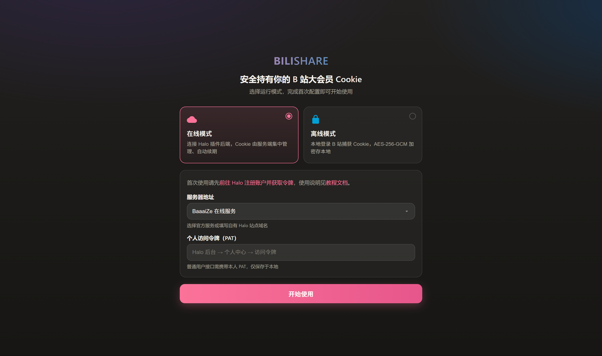
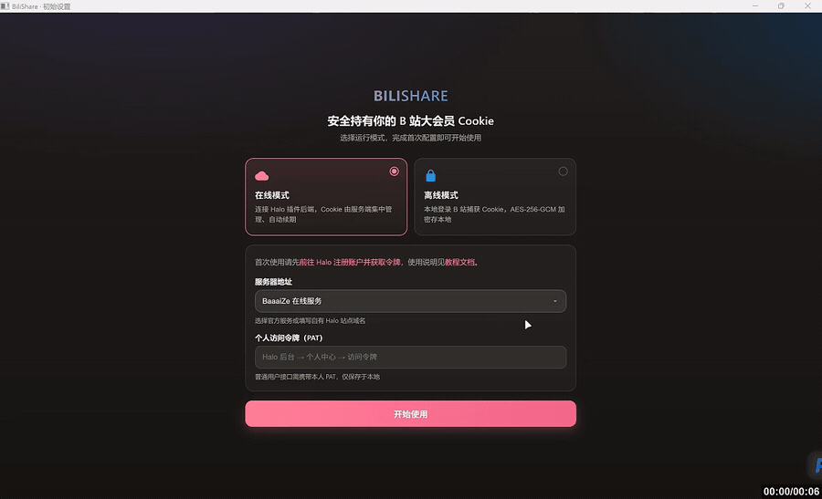
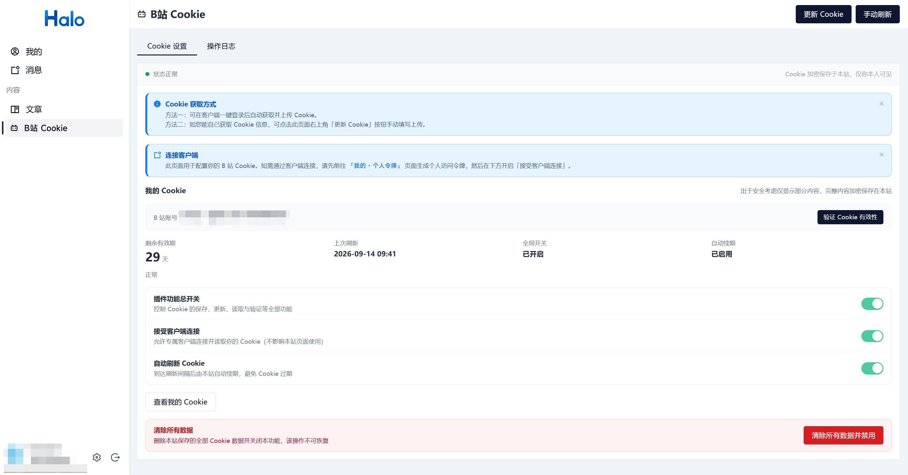
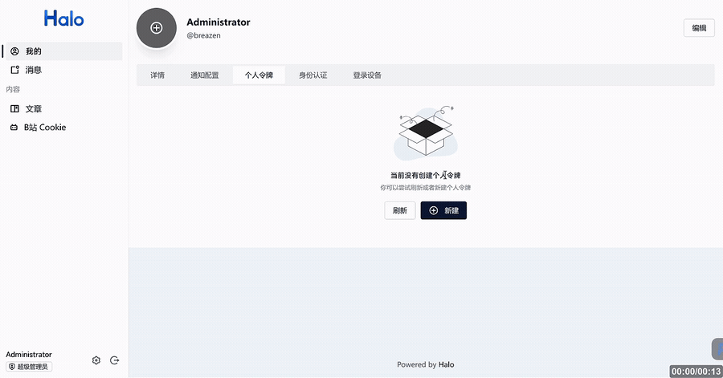
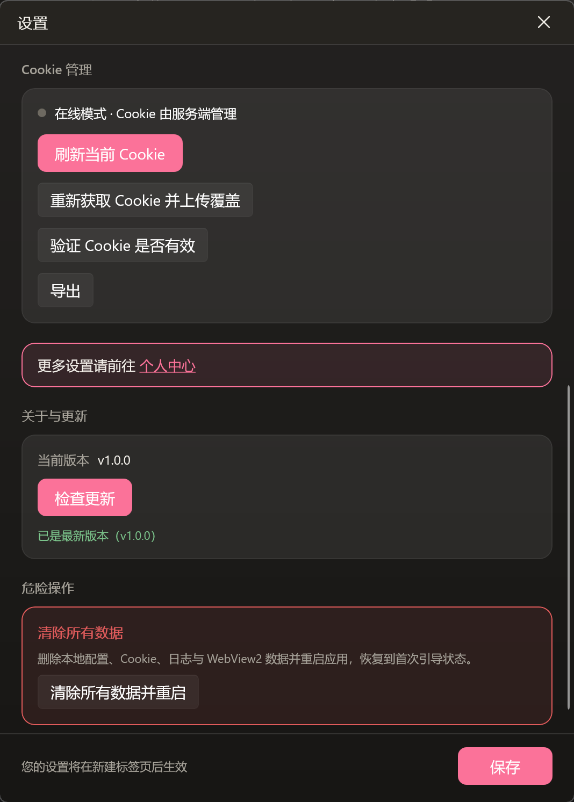
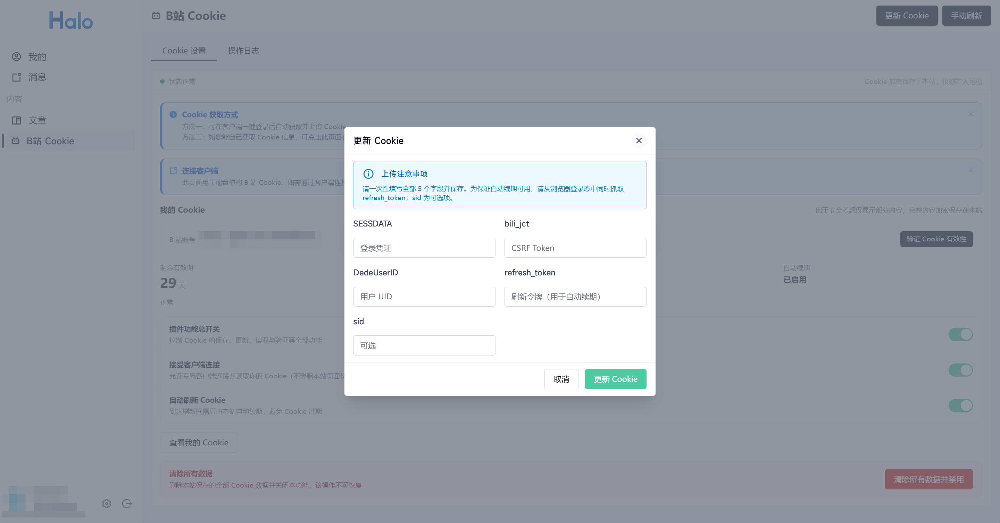
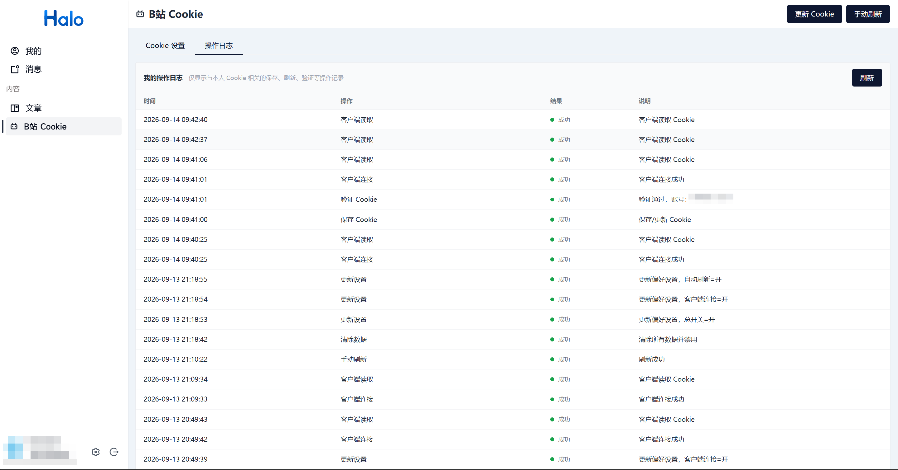
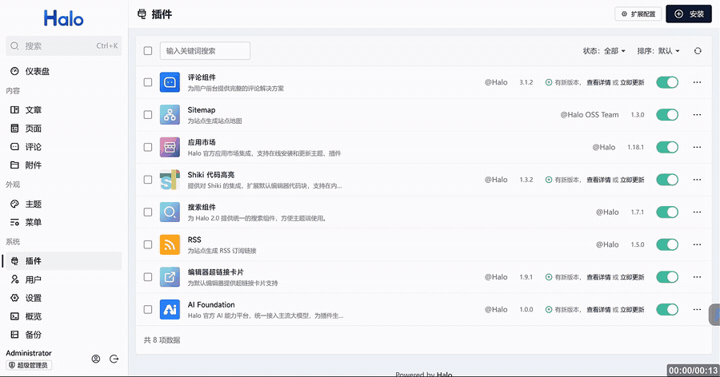
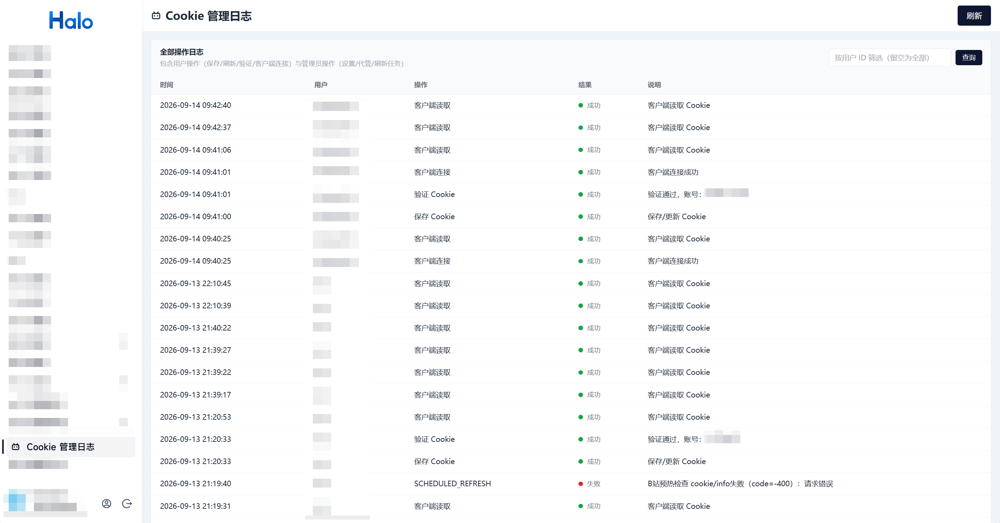

# BiliShare 使用教程

> B站大会员 Cookie 安全共享桌面客户端
>
> 本文档为 **用户使用教程**，仅涵盖软件的日常操作与功能说明，不含源码构建、打包等开发内容。
>
> 本教程由 AI 辅助整理：客户端内容基于既有文档，Halo 站点操作章节依据插件源码与界面整理。

---

## 目录

1. [软件简介](#一软件简介)
2. [快速开始](#二快速开始)
3. [下载与安装](#三下载与安装)
4. [界面概览](#四界面概览)
5. [首次启动与运行模式选择](#五首次启动与运行模式选择)
6. [Halo 站点操作教程（在线模式前置准备）](#六halo-站点操作教程在线模式前置准备)
7. [在线模式的配置](#七在线模式的配置)
8. [离线模式的使用](#八离线模式的使用)
9. [主界面：多标签浏览](#九主界面多标签浏览)
10. [设置中心详解](#十设置中心详解)
11. [Cookie 的导入与导出](#十一cookie-的导入与导出)
12. [自动更新](#十二自动更新)
13. [清除数据与重置](#十三清除数据与重置)
14. [常见问题](#十四常见问题)
15. [进阶用法](#十五进阶用法)

---

## 一、软件简介

**BiliShare** 是一个 Windows 桌面浏览器应用，核心功能是**安全获取并持有你的 B 站大会员 Cookie**，让你能够在设备上观看高清、付费等内容。

它提供两种运行模式：

- **在线模式**：连接 Halo 插件后端，Cookie 由服务端集中管理、自动续期，适合多设备共享登录态。
- **离线模式**：本地登录 B 站并捕获 Cookie，用 **AES-256-GCM** 加密保存在本机，不依赖任何在线服务，隐私性最强。

软件基于 **WinUI 3 + WebView2 + .NET 8** 开发，界面深色主题、多标签浏览，体验接近原生浏览器。

---

## 二、快速开始

下面用最简单的方式带你跑一遍完整流程（约 2 分钟）。**默认使用官方在线站点 `https://www1.baaaize.site`**（已部署好 Cookie 服务，无需自己搭建）；如果你有自己的 Halo 站点，也可[自建并导入插件](#153-自己部署-halo-插件站点管理员)后按同样步骤操作。详细步骤见后文对应章节。

### 第 1 步：启动软件

双击 `BiliShare.exe`（便携版）或从开始菜单打开（安装版）。首次启动会出现**模式选择引导页**。

### 第 2 步：选择在线模式

在引导页选择 **「在线模式」** 卡片。

### 第 3 步：启用 Cookie 服务

在官方站点（`https://www1.baaaize.site`）完成一次配置（只需做一次）：

1. 登录官方站点，进入 **用户中心（我的）→「B站 Cookie」** 页面。
2. 阅读免责声明后，开启 **「插件功能总开关」**。
3. 再开启 **「接受客户端连接」** 开关（允许客户端读取你的 Cookie）。

详见 [6.1 启用 Cookie 服务](#61-启用-cookie-服务)。

### 第 4 步：获取个人令牌

在站点的 **用户中心 →「个人令牌」** 页面创建一个访问令牌（PAT），创建后**立即复制保存**（仅显示一次）。

详见 [6.2 获取个人访问令牌（PAT）](#62-获取个人访问令牌pat)。

### 第 5 步：在客户端填入连接信息

回到引导页，填写：

- **服务器地址**：官方站点已内置，选择 **「BaaaiZe 在线服务」**（`https://www1.baaaize.site`）即可；自建站点则选择「其他」并填写你的站点域名。
- **个人访问令牌（PAT）**：粘贴上一步复制的令牌。

点击 **「开始使用」**。

### 第 6 步：开始使用

回到主界面后，**新建一个标签页**，即可带着大会员登录态正常浏览 B 站。

> 💡 **只要记住一句话**：选在线模式 → 站点开总开关 → 站点建令牌 → 客户端填地址和令牌 → 新建标签页开刷。

> 🎬 **在线模式完整流程演示**（选择在线模式 → 填入地址与 PAT → 开始使用）：

---

## 三、下载与安装

从项目 [Releases 页面](https://github.com/baize520mc/BiliShare/releases) 下载最新版本，有两种安装方式：

| 方式 | 适用场景 | 说明 |
|---|---|---|
| **安装包** `BiliShare_Setup_*.exe` | 常规使用 | Inno Setup 安装程序，默认安装到「安装包所在目录\BiliShare」，**无需管理员权限**，安装即用 |
| **便携版** `BiliShare_*_portable.zip` | 免安装 / U 盘携带 | 解压后双击 `BiliShare.exe` 即可运行 |

**系统要求：** Windows 10 / 11（x64），已安装 WebView2 运行时（一般随系统或自动获取）。

> **数据存放位置：** 软件的所有配置、Cookie、日志、WebView2 数据均保存在**软件根目录下的 `data/` 文件夹**中。删除整个软件目录即可彻底清除所有数据，**不会在系统其他位置残留任何文件**。

---

## 四、界面概览

启动后你会看到以下主要界面：

| 界面 | 作用 |
|---|---|
| **首次引导页** | 首次启动时出现，用于选择运行模式并完成初始配置 |
| **主界面** | 多标签浏览器窗口，日常浏览 B 站的主要界面 |
| **登录窗口** | 独立弹出，用于离线登录 B 站、捕获 Cookie |
| **设置窗口** | 集中进行模式切换、Cookie 管理、账号信息查看、更新与数据清除 |

以下将分别详细介绍。

---

## 五、首次启动与运行模式选择

第一次运行软件时，会自动打开**引导页**，标题为「安全持有你的 B 站大会员 Cookie」。

引导页让你在两种模式中二选一：

- **在线模式**：连接 Halo 插件后端，Cookie 由服务端集中管理、自动续期。
- **离线模式**：本地登录 B 站捕获 Cookie，AES-256-GCM 加密存本地。

选择任一模式卡片后，按提示填写对应信息（详见下一节），填写完成后点击底部粉色的 **「开始使用」** 按钮，即可进入主界面。

> 引导页底部会显示错误提示条（红色横幅）。若配置有误，会在此处提示错误原因。

---

## 六、Halo 站点操作教程（在线模式前置准备）

**在线模式**依赖 Halo 站点：Cookie 由站点上的 **bili-cookie 插件** 集中保存、自动续期。**默认使用官方在线站点 `https://www1.baaaize.site`**（已部署好插件）；如果你希望使用自己的 Halo 站点，可先按 [15.3 自己部署 Halo 插件](#153-自己部署-halo-插件站点管理员) 完成部署，再回到本章操作。

### 6.1 启用 Cookie 服务

1. 打开官方站点 `https://www1.baaaize.site`（或你的自建站点）并登录，进入 **用户中心（我的）→ 左侧「内容」分组 →「B站 Cookie」**（直达地址：`https://www1.baaaize.site/uc/bili-cookie`）。
2. 仔细阅读页面上方的**免责声明**（默认功能关闭）。
3. 在「我的 Cookie」区域开启 **「插件功能总开关」**。
4. 开启 **「接受客户端连接」** 开关（需先开启总开关），允许 BiliShare 客户端连接并读取你的 Cookie。

开启后，页面状态概览会显示「剩余有效期 / 上次刷新 / 全局开关 / 自动续期」等信息。

### 6.2 获取个人访问令牌（PAT）

客户端连接需要用到 Halo 的**个人访问令牌（PAT）**：

1. 进入 **官方站点 → 用户中心（我的）→ 个人令牌**（直达地址：`https://www1.baaaize.site/uc/profile?tab=pat`；自建站点为 `https://你的域名/uc/profile?tab=pat`）。
2. 点击 **「创建令牌」**，填写名称（如 `BiliShare`）。
3. 按需选择授权范围，创建成功后**立即复制并妥善保存**（令牌仅显示一次）。

> ⚠️ **PAT 是敏感凭据**：它等同于你的登录凭证，仅应保存在客户端本机 `data/` 目录下，切勿泄露给他人。如不慎泄露，可在个人令牌页随时**撤销**并重建。

完成以上两步后，即可回到客户端按 [第七章](#七在线模式的配置) 配置连接。

---

## 七、在线模式的配置

选择**在线模式**后，需要配置服务端连接信息。

### 7.1 服务器地址

服务器地址使用**下拉选择框**：

- 选择 **「BaaaiZe 在线服务」**：使用官方站点固定地址 `https://www1.baaaize.site`，无需手动填写（**推荐**）。
- 选择 **「其他」**：显示地址输入框，填写你自有 Halo 站点的域名（例如 `https://blog.example.com`，**不含** `/apis/...` 后缀）。

### 7.2 个人访问令牌（PAT）

在下方的「个人访问令牌（PAT）」输入框中填写你在站点获取的令牌。

> **获取方式：** 详见 [6.2 获取个人访问令牌（PAT）](#62-获取个人访问令牌pat)。
>
> **注意：** PAT 是敏感凭据，仅保存在本机 `data/` 下，不会上传到第三方。

### 7.3 完成配置

- 首次使用时，引导页会提示「请先前往 Halo 注册账户并获取令牌」，并提供教程文档链接（[Halo 站点操作教程](#六halo-站点操作教程在线模式前置准备)）。
- 填写完成后点击 **「开始使用」**。

### 7.4 设置页中的测试连接

进入设置窗口后，可点击 **「测试连接」** 按钮验证地址与 PAT 是否正确。连接成功会显示服务端状态信息（含 Cookie 有效期、B 站账号、自动续期状态等）。

---

## 八、离线模式的使用

选择**离线模式**后，无需配置任何在线服务，直接以本地方式获取 Cookie。

### 8.1 获取 Cookie

1. 进入**设置窗口**。
2. 在 **「Cookie 管理」** 板块中点击 **「获取 Cookie」**。
3. 弹出独立的**登录窗口**，窗口默认最大化，标题提示**「请使用密码或手机验证码登录」**。
4. 登录 B 站后，软件自动捕获 `SESSDATA`、`bili_jct`、`DedeUserID`、`refresh_token`、`sid` 等字段。
5. 捕获完成后，Cookie 自动用 **AES-256-GCM 加密**保存到本机 `data/offline/`。

### 8.2 本地 Cookie 的续期与校验

- **刷新 Cookie**：本地执行 B 站续期协议（自动续期），续期成功后覆盖保存。
- **有效性校验**：导入或获取后，软件会调用接口校验 Cookie 是否仍有效，并显示对应的 B 站用户名（UID）。

### 8.3 数据隔离

离线模式的 Cookie 与在线模式**完全隔离**，存储在不同的目录（`data/offline/`），互不影响。切换模式不会丢失各自的 Cookie。

---

## 九、主界面：多标签浏览

主界面是日常使用的主要内容区，包含：

### 9.1 标签栏（顶部）

- 支持**多标签浏览**，所有标签共享同一登录态（Cookie）。
- 新建、关闭、**点击切换**标签页。
- 关闭最后一个标签页时自动新建空白页。
- 鼠标**悬浮**在非活动标签上时会有浅色高亮提示。

### 9.2 导航工具栏

提供 **后退、前进、刷新、主页** 等浏览器基础操作，作用于当前活动标签页。旁边有只读地址栏显示当前页面网址。

### 9.3 标签栏右侧的控制按钮

系统默认标题栏已隐藏，最小化 / 最大化（还原）/ **关闭** 按钮整合在标签栏最右端。关闭按钮悬停时会变红，方便辨识。

### 9.4 窗口操作

- **拖动窗口**：按住标签栏空白区域拖动即可移动窗口；双击标签栏空白处可最大化 / 还原。
- **全屏**：窗口默认以最大化状态打开，可通过界面按钮进入全屏显示。全屏时自动隐藏标签栏与工具栏，退出全屏后恢复显示。

### 9.5 安全浏览特性

- **域名白名单**：仅允许访问 B 站相关域名（如 `.bilibili.com`、`.hdslb.com`、`.bilivideo.com` 等），访问其他域名的请求会被拦截并提示。
- **新窗口转标签**：页面中需要新窗口打开的链接，会在当前窗口内以新标签打开，避免跳出。

---

## 十、设置中心详解

点击主界面右上角（或按对应入口）打开**设置窗口**，集中管理以下内容：

### 10.1 运行模式

- 在线 / 离线单选切换。
- **注意：** 在线与离线模式使用**独立的配置**，分别存储、互不共享。

### 10.2 在线配置（在线模式）

- 服务器地址（官方 / 自定义）。
- 个人访问令牌（PAT）。
- **测试连接** 按钮。

### 10.3 账号信息

显示当前登录的账号信息，两种模式均会展示：

| 字段 | 说明 |
|---|---|
| B 站用户 | 用户名 + UID（或验证状态） |
| Cookie 有效期 | 剩余有效天数估算 |
| 上次刷新 / 保存时间 | 最近一次刷新或保存的时间 |

- **在线模式**：额外显示 Halo 账户名，数据来自服务端 `status` 接口。
- **离线模式**：基于本地 Cookie 计算有效期（B 站 SESSDATA 标准有效期约 30 天），并实时校验用户名。

### 10.4 Cookie 管理（在线模式）

- **刷新当前 Cookie**：调用服务端刷新接口，续期后自动同步。
- **重新获取并上传覆盖**：打开登录窗口重新捕获，确认后上传覆盖服务端 Cookie。
- **验证 Cookie 是否有效**：调用校验接口，显示对应 B 站账号。
- **导出**：从服务端拉取 Cookie 并导出为文件。

### 10.5 Cookie 管理（离线模式）

- **获取 Cookie**：打开登录窗口捕获并加密保存。
- **刷新 Cookie**：本地自动续期。
- **导入**：导入 `.bilicookie` 文件。
- **导出**：导出本地 Cookie 为 `.bilicookie` 文件。

### 10.6 关于与更新

- 显示**当前版本号**。
- **检查更新** 按钮：一键检查并升级到最新版本（详见第十二章）。

### 10.7 危险操作

- **清除所有数据并重启**：删除本地配置、Cookie、日志与 WebView2 数据并重启应用，恢复到首次引导状态。此操作**不可撤销**，请谨慎使用。

> **生效提示：** 设置窗口底部会提醒「您的设置将在新建标签页后生效」。因为 Cookie 注入发生在标签页导航之前，因此**修改设置后，请新建标签页**使其生效。

---

## 十一、Cookie 的导入与导出

Cookie 文件以 `.bilicookie` 扩展名保存，用于备份或在设备间迁移。

### 11.1 导出

在设置窗口的「Cookie 管理」板块点击 **「导出」**，选择保存位置即可生成 `.bilicookie` 文件。

- **在线模式**：导出的是服务端当前保存的 Cookie。
- **离线模式**：导出的是本地加密存储的那份 Cookie。

### 11.2 导入

点击 **「导入」**，选择 `.bilicookie` 文件。导入成功后：

- 自动加密保存到本地；
- 立即校验 Cookie 有效性，弹出窗口告知「Cookie 有效（用户名）」或具体失效原因。

> **提示：** 导入的 `.bilicookie` 文件是使用软件本机生成的加密格式，导入需与生成时的密钥匹配方可成功解密。

---

## 十二、自动更新

BiliShare 内置自动更新功能，无需手动下载覆盖。

### 12.1 检查更新

进入**设置窗口 → 关于与更新**，点击 **「检查更新」** 按钮：

- 若为最新版本，显示「已是最新版本（vX.Y.Z）」。
- 若发现新版本，弹出确认对话框：「发现新版本，当前 vX.Y.Z，最新 vX.Y.Z，是否立即更新？」。

### 12.2 执行更新

点击 **「立即更新」** 后，软件会：

1. 从 GitHub Releases 下载最新便携包；
2. 解压到临时目录；
3. 退出当前进程，由脚本覆盖程序文件并自动重启。

### 12.3 更新不影响数据

更新过程**只覆盖程序文件，绝不会触碰 `data/` 目录**——你的配置、Cookie、日志全部保留，更新完成后即可继续使用，无需重新配置或登录。

---

## 十三、清除数据与重置

如果你需要**彻底重置**软件，或遇到无法解决的问题，可以使用「清除所有数据」功能。

1. 打开**设置窗口**。
2. 在 **「危险操作」** 板块点击 **「清除所有数据并重启」**。
3. 弹出确认提示后，点击 **「清除并重启」**。

执行后将删除：

- 配置文件（含模式、服务端地址、PAT）；
- 本地 Cookie 与加密密钥；
- 日志与 WebView2 用户数据。

应用随即重启并回到**首次引导状态**，需要重新选择模式并配置。

> 此操作**不可撤销**，清除前如有需要，请先导出 Cookie 或备份 `data/` 目录。

---

## 十四、常见问题

### Q1：设置了 Cookie 后，网页仍未登录？

修改设置后，**需新建标签页**才能生效。Cookie 注入发生在标签页导航之前，直接在旧标签页刷新可能不生效。

### Q2：离线模式 Cookie 过期了怎么办？

离线 Cookie 一般约 **30 天**有效。过期后，在设置窗口「Cookie 管理」重新**获取 Cookie**，或使用**刷新**功能自动续期。

### Q3：不小心清除了所有数据，还能找回 Cookie 吗？

不能。清除操作不可逆。如有需要请提前使用「导出」功能备份 `.bilicookie` 文件，清除后再通过「导入」恢复。

### Q4：在线模式提示连接失败 / Token 无效？

- 确认服务器地址（官方或自定义）正确；
- 确认 PAT 有效且未过期，必要时重新获取；
- 在设置页点击「测试连接」查看具体错误提示（红色横幅会给出原因）；
- 确认已在站点开启「插件功能总开关」与「接受客户端连接」（见 [Halo 站点操作教程](#六halo-站点操作教程在线模式前置准备)）。

### Q5：访问某些网站被拦截 / 无法播放？

由于**域名白名单**安全机制，软件仅允许访问 B 站相关域名。请确认目标页面属于 B 站生态（`.bilibili.com`、`.bilivideo.com` 等）。若为外部跳转链接，建议复制到系统浏览器打开。

### Q6：如何彻底卸载 / 清除软件？

直接删除软件根目录即可。`data/` 内所有数据（配置、Cookie、日志、WebView2）会一并清除，系统不会残留任何文件。**无需**额外清理注册表或系统目录。

### Q7：在 Halo 站点清除了数据，客户端会怎样？

清除后，客户端在线模式读取 Cookie 会提示「未配置 / 已失效」。请在客户端「Cookie 管理」点击 **「重新获取并上传覆盖」**，重新上传后即可恢复。

---

## 十五、进阶用法

以下内容面向有更高需求的用户：手动管理 Cookie，或自己部署站点插件。

### 15.1 手动上传 Cookie

若不想使用客户端自动抓取，或需要手动修正 Cookie，可在站点页面直接填写：

1. 进入 **用户中心 →「B站 Cookie」** 页面。
2. 点击右上角 **「更新 Cookie」** 按钮。
3. 一次性填写 5 个字段并确认：

| 字段 | 必填 | 说明 |
|---|---|---|
| `SESSDATA` | ✅ | 登录凭证 |
| `bili_jct` | ✅ | CSRF Token |
| `DedeUserID` | ✅ | 用户 UID |
| `refresh_token` | ✅ | 刷新令牌，自动续期依赖（缺失则无法自动刷新） |
| `sid` | ❌ | 可选 |

保存后插件会自动抓取你的 B 站账号信息，页面展示「B 站账号（用户名 + UID）」与剩余有效期。

> 提示：为保证自动续期可用，请在浏览器登录态中**同一次会话**内一次性抓取全部字段，避免 `refresh_token` 与 Cookie 不匹配（B 站错误码 86095）。

### 15.2 在站点管理你的 Cookie

除了客户端，站点页面本身也可完成日常管理：

- **状态概览**：查看剩余有效期、上次刷新时间、自动续期状态。
- **手动刷新**：点击刷新按钮，触发服务端自动续期协议。
- **验证有效性**：调用 B 站接口校验，并显示对应 B 站账号。
- **操作日志**：本人全部操作（保存 / 刷新 / 验证 / 客户端连接）可回溯，页面切换至「操作日志」标签查看。

### 15.3 自己部署 Halo 插件（站点管理员）

如果你希望在自己的 Halo 站点上开启 Cookie 服务，可自行部署插件（环境要求：**Halo ≥ 2.26.0**）。

1. 从 [bili-cookie 的 Releases 页面](https://github.com/baize520mc/bili-cookie/releases) 下载 `bili-cookie-*.jar` 插件包。
2. 登录 **Halo 后台**，进入左侧菜单 **「插件」**。
3. 点击 **「安装」** → 上传 JAR 文件 → 安装完成后点击 **「启用」**。

启用后，站点管理员可进行以下管理：

- **全局设置**：后台 → 插件 → Bilibili Cookie管理 → 设置，可调整 **全局开关 / 刷新间隔（小时）/ Cookie 预估有效期（天）**。
- **查看日志**：后台 → 系统 → **「Cookie 管理日志」**，聚合查看全部用户操作，支持按用户 ID 筛选。
- **分配管理角色**：在 Halo 用户角色管理中，将插件提供的 **「Cookie 管理」** 角色（`bili-cookie-role-manage`）授权给需要代管的用户。

---

## 隐私与安全提示

- B 站 Cookie 属于**敏感凭据**，请妥善保管，勿随意泄露或分享给他人。
- 离线模式加密密钥随机生成并保存在本机，请勿删除 `data/` 下的 `key.dat`，否则将无法解密已保存的 Cookie。
- **在线模式**的 Cookie 由 Halo 站点加密保存（AES-256-GCM），页面仅脱敏展示；站点后台保留操作日志。
- 个人访问令牌（PAT）等同于登录凭证，请勿泄露；可在 Halo 个人令牌页随时撤销。
- 请遵守 B 站《用户协议》与《社区规范》，Cookie 请仅用于个人合法用途。

---

*本教程基于 BiliShare v1.0.0 与 bili-cookie 插件 v1.0.0。界面以实际版本为准，功能会随版本迭代而更新。*

---

## 附录：教程资源清单

以下资源已全部就绪，存放于 `docs/screenshots/` 与 `docs/images/`：

### 客户端（BiliShare）

| 序号 | 文件 | 对应章节 | 说明 | 现状 |
|---|---|---|---|---|
| 1 | `screenshots/screenshot-1.png` | 二 · 第 1 步 | 首次引导 · 模式选择页 | ✅ 已有 |
| 2 | `screenshots/screenshot-2.png` | 九 · 主界面 | 多标签浏览主界面 | ✅ 已有 |
| 3 | `screenshots/screenshot-3.png` | 十 · 设置中心 | 设置窗口 · 在线配置与账号信息 | ✅ 已有 |
| 4 | `screenshots/screenshot-4.png` | 十 · 设置中心 | 设置窗口 · Cookie 管理与关于更新 | ✅ 已有 |
| 5 | `screenshots/gif-online-start.gif` | 二 · 快速开始 | 动图：在线模式启动完整流程 | ✅ 已有 |

### Halo 站点

| 序号 | 文件 | 对应章节 | 说明 | 现状 |
|---|---|---|---|---|
| 1 | `images/user-cookie-settings.png` | 6.1 | 用户中心「B站 Cookie」主页（含总开关） | ✅ 已有 |
| 2 | `images/update-cookie-dialog.png` | 15.1 | 「更新 Cookie」弹窗（5 字段） | ✅ 已有 |
| 3 | `images/user-operations-log.png` | 15.2 | 用户「操作日志」面板 | ✅ 已有 |
| 4 | `images/admin-logs.png` | 15.3 | 管理端「Cookie 管理日志」 | ✅ 已有 |
| 5 | `screenshots/halo-pat.gif` | 6.2 | 个人令牌（PAT）创建流程（录屏） | ✅ 已有 |
| 6 | `screenshots/halo-plugin-install.gif` | 15.3 | Halo 后台插件安装 / 启用（录屏） | ✅ 已有 |
